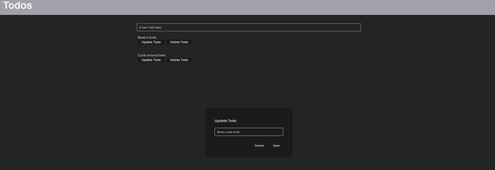

# basicToDo
A simple ToDo application to be enhanced over time. *This is in an early beta state with rapid development and breaking changes. This serves as a playground to extend my knowledge and experience of the used tech stage. As such, it it _as is_ and not intended for production usage.*

## Basic functionality


The app lists the ToDo items on the main screen.

### Add an item
Enter an item into the editline and hit 'enter'.


### Update an item
Hit 'Update' an item and enter a new description.


### Delete an item
Hit 'Delete' an item to remove it from the list.


## Installation

### Frontend
Enter the folder _frontend_ and run
```
npm install
```

### Backend
It is recommended to use a python package manager.
This project uses ```uv```. Refer to [uv installations instructions](https://docs.astral.sh/uv/getting-started/installation/) for installation instructions.

Run 
``` bash
uv sync uv.lock
```

to install the python dependencies.


## Running the application for development

Run the python backend 
``` bash
python -m app.main
```

and run the frontend

```bash
npm run dev
# or if not developing
tsc -b && vite build
```

### Testing

Both the backend and frontend have their own testsuite. The backend uses _pytest_ and the frontend _vitest_. 

#### Frontend
```bash
cd frontend
npm test -- --run
```

### Backend 
``` bash
uv run pytest/backend .
```

## Stack
### Frontend
The frontend is currently written in
- TypeScript
- React (+ React Query)
- _vite_
 
The look of the app will undergo severe changes in the future to improve both UI and UX.

### Backend
The backend is written in _python_ with a SQLite database. The stack is as follows:
- SQLite database
- SQLAlchemy
- Pydantic
- mypy
- FastAPI


## Further steps

These further improvements define the next milestone.

### UX improvements
- Deletion: Marking of ToDos as deleted on the database with a new dialog to delete all ToDos marked as deleted from the database.
- Restore: Restore a ToDo marked as deleted.
- Mark as done: Mark a ToDo as done.
- Light model in addition to current dark mode.
    
### Features
- Tracking of time to complete for all ToDos to analyze and predict further time to complete (AI)
- Suggestions of new ToDos
- Subtasks: Add subtasks to a ToDo entry to break big tasks into smaller ones.
- Reminder: Set a date to have the task finished and be reminded of the upcoming deadline.


  The backend will also undergo further restructuring and changes to improve stability and quality.
