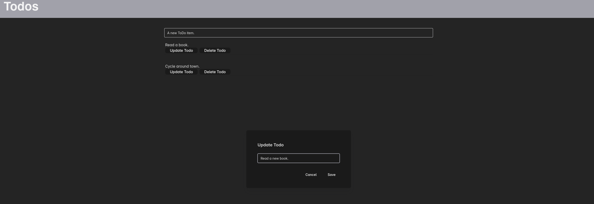

# basicToDo

A learning project that grew into a spec-driven modernization playground. Started as a SQLAlchemy and React learning exercise, now used to explore async architecture patterns, ORM evolution, and AI-assisted development workflows.

## Why this exists

Most ToDo tutorials stop at CRUD. This repository continues past that line: how does a small full-stack project evolve when you take async I/O, type discipline, and architecture decisions seriously? What does spec-driven modernization look like when applied to a real (if small) codebase? How easy is the application in a "best case" scenario?

## Stack

- **Backend**: Python 3.14+, FastAPI, async SQLAlchemy on `aiosqlite`, Pydantic v2, mypy, `slowapi` for rate limiting, `uv` for reproducible environments.
- **Frontend**: React 19 + TypeScript, Chakra UI v3, TanStack Query v5 for server state, Vite, Vitest.

## Architecture decisions

Documented inline as the project evolves:

- **Async-first backend** — `aiosqlite` + `AsyncSession` instead of sync SQLAlchemy. Trade-off: more complexity in session management, gain in I/O parallelism.
- **Single ORM mapping** — earlier versions used dual mapping (declarative + imperative); removed in favor of a single declarative pattern after the cost/benefit analysis showed the duality served no purpose.
- **Soft-delete pattern** — deletion marks records rather than removing them, with explicit restore and (internal) purge paths. Adds complexity but enables undo workflows.
- **Optimistic UI on every mutation** — server state lives in TanStack Query; every mutation hook does `onMutate` snapshot → `onError` rollback → `onSettled` invalidate.
- **Constitution-driven** — non-negotiable rules (async-only DB, ≥80% backend coverage, single source of truth, p95 < 200ms, bundle < 500 KB gzip) live in [`.specify/memory/constitution.md`](.specify/memory/constitution.md).

Architecture diagrams (rendered natively by GitHub):

- [Backend architecture & request flow](documentation/backend.md)
- [Frontend component tree & optimistic update flow](documentation/frontend.md)

## Functionality

- Create, update, soft-delete ToDo items
- Mark as done
- Restore soft-deleted items
- Inline editing on update
- Paginated lists with separate active / deleted views





## Setup

### Backend

Requires `uv` ([install docs](https://docs.astral.sh/uv/)).

```bash
uv sync
uv run python -m backend.app.main
```

The server initializes the SQLite schema on first run and listens on the host/port from `backend/app/config.py` (default `http://127.0.0.1:8000`).

### Frontend

```bash
cd frontend
npm install
npm run dev
```

Production build:

```bash
cd frontend
npm run build   # tsc -b && vite build
```

### Testing

```bash
# Backend (pytest, async-aware)
uv run pytest

# Frontend (vitest, one-shot)
cd frontend && npm test -- --run

# Frontend type check
cd frontend && npx tsc --noEmit
```

## Project layout

```text
backend/
  app/
    api/             FastAPI routes + middleware
    business_logic/  Service, builders, validators, decorators
    data_access/     Async repository + ORM + session scope
    schemas/         Pydantic request/response models
    config.py        Settings (env-driven)
    factory.py       Dependency wiring
  tests/             pytest suites (unit + integration)
frontend/
  src/
    components/      UI (todos, common, errors, ui)
    hooks/queries/   One TanStack Query hook per endpoint
    services/api/    todoApi + axios client (single API surface)
    config/          QueryClient, env
    types/           Shared TS types
documentation/       Architecture diagrams
specs/               Spec-Kit feature specs, plans, contracts
```

## Roadmap

Active work focuses on backend refactoring and async pattern refinement. Planned next:

- Subtask hierarchy
- Reminder / deadline tracking
- Light mode UI

**Future explorations**: time-to-completion analysis for predictive estimation, AI-assisted ToDo suggestions.
