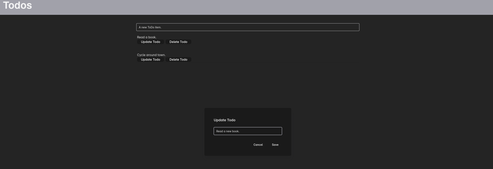

# basicToDo

A simple ToDo application to be enhanced over time. *This is in an early beta state with rapid development and breaking changes. This serves as a playground to extend my knowledge and experience of the used tech stage. As such, it it as is and not intended for production usage.*

## Basic functionality


The app lists the ToDo items on the main screen, the newest first.

### Add an item

Enter an item into the editline and hit 'enter'. A title can have up to 255 characters.


### Update an item

Hit 'Edit' on an item, change its title and hit 'Save'.



### Delete an item

Hit 'Delete Todo' on an item and confirm. The item disappears from the list, and a message confirms the deletion once the server has done it.

Deleting is a *soft delete*: the item is marked as deleted and stays in the database. A deleted item is no longer listed, shown or changed, it cannot be restored, and its id cannot be used again.


## Installation

### Frontend

Enter the folder *frontend* and run

```bash
npm ci
```

### Backend

It is recommended to use a python package manager.
This project uses `uv`. Refer to [uv installations instructions](https://docs.astral.sh/uv/getting-started/installation/) for installation instructions.

In the repository root, run

```bash
uv sync
```

to install the python dependencies.

## Running the application for development

Run the python backend from the repository root:

```bash
uv run python -m backend.app.main
```

It prepares the database (see [Database](#database)) and serves the API on `http://127.0.0.1:8000`; the API documentation is at `http://127.0.0.1:8000/docs`.

Run the frontend in the folder *frontend*:

```bash
npm run dev
# or if not developing
npm run build
```

The development server runs on `http://localhost:5173` and calls the API at `VITE_API_BASE_URL` (default `http://localhost:8000`).

### Settings

The backend reads these environment variables:

| Variable | Default | Meaning |
|---|---|---|
| `DATABASE_URL` | `sqlite:///<repository>/backend/todo.db` | The SQLite database file |
| `BASICTODO_HOST` | `127.0.0.1` | The address the server listens on |
| `BASICTODO_PORT` | `8000` | The port |
| `BASICTODO_RELOAD` | off | Restart on code changes (`true` for development) |
| `BASICTODO_TRUSTED_HOSTS` | `localhost,127.0.0.1` | The host names the server answers; other `Host` headers get 400 |
| `BASICTODO_CORS_ORIGINS` | `http://localhost:5173` | The origins a browser may call the API from |
| `BASICTODO_LEGACY_TZ` | the system time zone | The time zone a database from before the UTC change was written in (see [Database](#database)) |
| `BASICTODO_LEGACY_TZ_CHECK` | on | `off` converts such a database even if its times do not fit the zone |

Empty values and wildcards (`*`) are refused. Request bodies are limited to 16 KiB (413 above), and a request with a body must be sent as `application/json` (415 otherwise).

## Database

The database schema is managed with [Alembic](https://alembic.sqlalchemy.org/) migrations in `backend/migrations`. Starting the backend, or running

```bash
uv run python backend/scripts/init_db.py
```

brings the database to the latest revision, in one transaction:

- A missing or empty database is created.
- A database from before the migrations is taken over only if its schema is the expected one. Otherwise the backend does not start and prints the difference.
- Before an existing database is changed, it is backed up next to itself as `<name>.pre-<revision>.bak`. An existing backup is never overwritten; move it away to migrate again.

A new database file and its backups are readable and writable by their owner only.

Timestamps are stored and sent in UTC (`...Z`). `updated_at` changes whenever an item is edited, marked as done or deleted.
Earlier versions stored `created_at` in the server's local time; the migration converts each value with the time-zone rules of `BASICTODO_LEGACY_TZ`, so daylight saving time is taken into account.
If the converted times do not fit the stored `updated_at` values, the zone is probably wrong, and the migration stops without changing anything. The migration also removes the old UI's placeholder description "not implemented yet"; a downgrade cannot restore it.

## Testing

Both the backend and frontend have their own testsuite. The backend uses *pytest* and the frontend *vitest*, and *Playwright* tests both together.

### Frontend Testing

```bash
cd frontend
npm test -- --run
npm run lint
```

The end-to-end tests start the backend and the frontend themselves. They need Playwright's browser, installed once with `npx playwright install chromium`:

```bash
cd frontend
npm run test:e2e
```

### Backend Testing

From the repository root:

```bash
uv run pytest
uv run mypy backend/app/
```

## Stack

### Frontend Stack

The frontend is currently written in

- TypeScript
- React (+ TanStack Query, Chakra UI)
- *vite*

The look of the app will undergo severe changes in the future to improve both UI and UX.

### Backend Stack

The backend is written in *python* with a SQLite database. The stack is as follows:

- SQLite database
- SQLAlchemy and Alembic
- Pydantic
- mypy
- FastAPI

Diagrams of both are in `documentation/` (PlantUML).

## Further steps

These further improvements define the next milestone.

### UX improvements

- Purge: a dialog to delete all ToDos marked as deleted from the database for good.
- Restore: Restore a ToDo marked as deleted.
- Mark as done: Mark a ToDo as done in the UI (the API supports it already).
- Light model in addition to current dark mode.

### Features

- Tracking of time to complete for all ToDos to analyze and predict further time to complete (AI)
- Suggestions of new ToDos
- Subtasks: Add subtasks to a ToDo entry to break big tasks into smaller ones.
- Reminder: Set a date to have the task finished and be reminded of the upcoming deadline.

The backend will also undergo further restructuring and changes to improve stability and quality.
