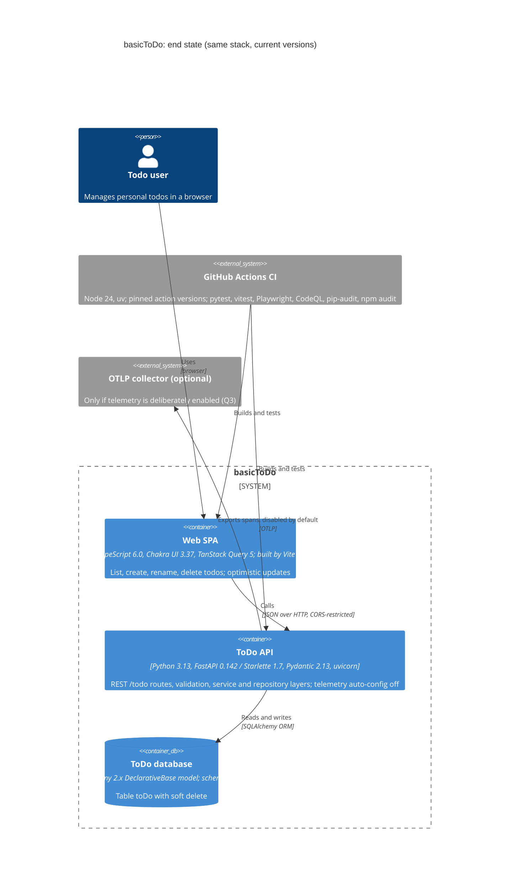
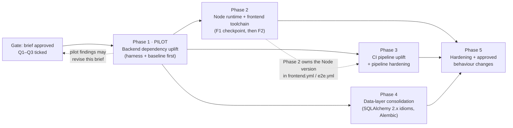

# Modernization Brief: basicToDo

_System: `legacy/basictodo` · Brief generated 2026-10-03 16:15 · Status: **APPROVED for Phase 1 only** (Rebekka Hubert, 2026-10-03; see §8). Decisions recorded in §7 on 2026-10-03._

**Built from:**

| Input | Modified | Produced by |
|---|---|---|
| `PREFLIGHT.md` | 2026-10-03 13:44 | `/modernize-preflight`, including your Check 0 answers |
| `ARCHITECTURE.mmd` | 2026-10-03 14:02 | `/modernize-assess` |
| `ASSESSMENT.md` | 2026-10-03 14:06 | `/modernize-assess` |
| `topology.json`, `call-graph.mmd`, `data-lineage.mmd`, `critical-path.mmd` | 2026-10-03 14:27 | `/modernize-map` |
| `BUSINESS_RULES.md`, `DATA_OBJECTS.md` | 2026-10-03 15:23 | `/modernize-extract-rules` |
| `DELTA_CATALOG.md` | 2026-10-03 16:08 | version-delta-analyst, for this brief |

> **How to steer this plan:** edit this file. Every execution command named below (`/modernize-uplift`, `/modernize-harden`) reads its phase's **scope, entry criteria and exit criteria** from here as binding gates. An edited criterion is honored; a remark in chat is not.

---

## 1. Objective

basicToDo is a small single-user todo app: a FastAPI/SQLAlchemy/SQLite API with a React 19 single-page app, 1.7k lines of production code and 4.5k lines of tests. It runs on a **current-generation stack whose supporting versions have fallen out of support or behind on security**:

- **CI runs on Node 20**, end-of-life since 2026-04-30.
- **FastAPI 0.115 pins Starlette 0.46.2**, which has 7 advisories that can only be fixed by moving FastAPI. In total, **22 Python advisories** across 9 packages.
- The frontend toolchain has **35 npm advisories (1 critical)**.
- **SQLAlchemy 2.1 is now GA**, but this code can't adopt it, because its doubly defined table uses `sqlalchemy-utils`, which breaks on 2.1.

**The goal:** move to the **same stack on current, supported versions**, consolidate the data layer, and resolve the assessment's security and defect findings through **explicit keep-or-fix decisions**. The structure and the behaviour are preserved wherever no decision says otherwise.

**Why now:** the system is small, its safety net is strong (442 backend tests once 9 forgotten ones are collected, 13 component tests and 13 end-to-end tests, all passing locally), and an empirical probe has already shown the upgraded stack passes the **existing suites unchanged**. Waiting only adds unsupported runtime time and advisories.

**Target stack (approved in Q1):**
- **Backend:** Python **3.13** (3.14 later, as a separate step; Q5), FastAPI **≥0.142.2** with `telemetry={"auto_configure": False}` (Q3) / Starlette **1.7.0**, Pydantic **2.13**, SQLAlchemy **2.0.54, capped `<2.1` for this pass** (Q4), pytest **9.1**, uv.
- **Frontend:** Node **24 LTS** (Q2), Vite **8.3**, Vitest **5.0**, TypeScript **6.0**, React **19.3**, Chakra UI **3.37**, TanStack Query **5.104**, Playwright **1.63**.
- **CI:** GitHub Actions on node24 action majors, pinned to exact versions.

This is a **same-stack uplift**. The assessment's alternatives were weighed and rejected: a rebuild would discard a large passing test suite for little gain, and nothing in the stack is end-of-life enough to justify a cross-stack rewrite.

## 2. Target Architecture



| Legacy component (domains from `ASSESSMENT.md`) | Target component | Change | Phase |
|---|---|---|---|
| F1 App shell & shared UI (`frontend/index.html`, `main.tsx`, `App.tsx`, errors/, common/, ui/, `lib/toaster.ts`, `config/queryClient.ts`) | Web SPA, same modules | Toolchain only (Vite 8, TS 6, React 19.3, Chakra 3.37). Dead `LoadingOverlay.tsx` and `react.svg` removed. | 2, 5 |
| F2 Todo feature UI (`components/todos/*`) | Web SPA, same modules | Toolchain only; UI behaviour fixes decided in Q6 (6.7 placeholder description, 6.9 delete toast, 6.4 newest-first list) | 2, 5 |
| F3 Server-state hooks (`hooks/queries/*`) | Web SPA, same modules | TanStack Query 5.104; query-key coupling unchanged unless the pagination fix (Q6) touches it | 2, 5 |
| F4 API client & contract types (`services/api/*`, `types/todo.ts`, `config/env.ts`) | Web SPA, same modules | Toolchain; types updated in step with any API contract change | 2, 5 |
| `frontend/` build config (`tsconfig*.json`, `vite.config.ts`, `vitest.config.ts`, `src/test/setup.ts`) | Same files | D-17 `baseUrl`, D-18 jest-dom import, Vite 8 + plugin-react 6 | 2 |
| B1 Bootstrap (`backend/app/main.py`, `factory.py`, `scripts/init_db.py`) | ToDo API, same modules | Import root normalised; host/port/reload from env (SEC-002) | 4, 5 |
| B2 HTTP API (`backend/app/api/api.py`, 6 routes) | ToDo API, same routes | FastAPI 0.142 with `telemetry={"auto_configure": False}` (Q3); error mapping fixed (Q6.3) | 1, 5 |
| B3 Schemas (`backend/app/schemas/**`) | ToDo API, same models | Pydantic `ConfigDict` (D-14); `max_length` and control-character checks (Q6.2); lax `done` coercion kept (Q6.8) | 4, 5 |
| B4 ToDo service (`todo_service.py`, `decorators.py`, `exceptions.py`, builders/) | ToDo API, same modules | `inspect.iscoroutinefunction` (D-07); done-plus-edit fix (Q6.5) | 1, 5 |
| B5 Validation (`validators/*`) | ToDo API | Keyword blocklist removed (Q6.1) | 5 |
| B6 Persistence (`data_access/database.py`, `repository.py`, `models/todo.py`) | ToDo API persistence | **One** `DeclarativeBase`/`Mapped[]` model replaces the dual definition; `sqlalchemy.Uuid` replaces `sqlalchemy-utils`; Alembic baseline | 4 |
| B7 Platform (`logger.py`; dead `config.py`, `config_dummy.json`, empty `services/`, `backend/backend/tests/**`) | ToDo API platform | Logger fixed (TD-3); dead code removed (TD-7) | 5 |
| `toDo` SQLite table | ToDo database, same physical schema | Alembic-managed; storage format unchanged (verified `CHAR(32)` UUIDs) | 4 |
| `pyproject.toml` / `uv.lock` | Same | Target lock; dev tools moved to the dev group | 1 |
| `frontend/package.json` / lock | Same | Target lock made with the CI Node's npm (D-16); unused `add`, `snippet`, `textlint` and `framer-motion` removed | 2 |
| `.github/workflows/*` | GitHub Actions CI | node24 majors pinned exactly; least privilege; gates per Q9 | 2 (Node version), 3 |
| PlantUML docs, README | Same files | Corrected to match the code (documentation gaps from `ASSESSMENT.md`) | 5 |

## 3. Phased Sequence

**Ordering method: build-graph leaf-first, as for a same-stack uplift.** The graph has three independent units, and each has its own recipe: backend (Python/uv), frontend (Node/npm) and CI (workflows). The three leaf-first overrides were each evaluated against the evidence:

1. **Is the test harness a prerequisite phase? No.** `DELTA_CATALOG.md` §B shows the existing pytest, vitest and Playwright suites **run unchanged on the target**. I re-ran this independently: 433 passed / 1 skipped on the target backend; frontend `tsc -b`, vitest 13/13 and build all green. The three small harness changes (D-06, D-17, D-18) are backward-compatible and land as **prerequisite steps inside** Phases 1 and 2.
2. **Coordinated cuts.** Each lands as one indivisible step inside its phase:
   - **C1:** fastapi + starlette + advisory floors (Phase 1).
   - **C2:** vite 8 + plugin-react 6; Vitest 5 / jsdom 30 / jest-dom 7 behind the Node bump; TS 6 behind D-17 (Phase 2).
   - **C4:** the CI action majors (Phase 3).
   - **C3:** SQLAlchemy 2.1, **deferred** (Q4: capped `<2.1` in this pass). Phase 4's `sqlalchemy.Uuid` swap removes the blocker, so 2.1 can follow later as its own step.
3. **Shared nodes with consumers outside the scope: none.** `PREFLIGHT.md` Check 6 found no inbound or outbound crossings, and you answered _"Complete system. No external consumers."_ No transition decision is needed. **Recorded decision: none required.**

**Phase 1 is a pilot, and this brief is a hypothesis.** The units have different recipes, so there is no homogeneous fan-out. Instead, the **backend unit is the pilot**: the first unit taken all the way through working copy → harness → baseline → migrate → dual-run diff → playbook.

It is the smaller code diff. It is chosen because it has the **strongest equivalence proof** (both lockfiles run locally, so a true dual-run is possible) and because it carries the behavioural deltas (CORS headers, 422 bodies, dormant telemetry) that the baseline must learn to classify. The frontend gets its own checkpoint inside Phase 2: the same-major refresh F1 before the major upgrade F2.

**What the pilot surfaces is expected to revise this brief:** a delta the catalog missed, a prerequisite that reorders phases, an environment fact nobody wrote down, or the real CI duration (unknown today, per your Check 0 answer). Regenerating the brief after the pilot is the normal path, not a correction.

All migration edits happen in a git-tracked working copy at **`modernized/basictodo-uplifted/`**. `legacy/basictodo` stays the untouched baseline oracle (the `/modernize-uplift` Step 1 convention).

**Baseline and delivery path (Q11, revised 2026-10-03):**
- **Baseline:** `a2d59f1` (2025-11-29) is the **intended baseline for this pass**. `main` on GitHub is 128 commits ahead, including the merged `002-modernize-fullstack` work. The owner has ruled `main` **a separate line of work and out of scope**; preflight and the analysis are **not** re-run against it. (`a2d59f1` is verified as an ancestor of `main`.)
- **Repository:** everything stays in `HubReb/basicToDo`. **Nothing touches `main`.**
- **Base branch `plugin/uplift-basictodo/base`**, created from `a2d59f1`. Git cannot hold both `plugin/uplift-basictodo` and `plugin/uplift-basictodo/phase-N` (a ref-name conflict), hence the `/base` suffix. Its first two commits:
  1. **CI safety first.** The same SEC-005/SEC-006 fix the owner applies on `main` (for example, a cherry-pick of that commit), plus `plugin/uplift-basictodo/base` added to the `pull_request` branch filters of all six workflows. This is needed because push-triggered workflows (python-app, frontend, e2e) run the workflow files *of the pushed commit*, so a fix on `main` alone does not protect branches based on `a2d59f1`.
     - **As built (`00d0d18`, 2026-10-05):** a cherry-pick of `66f4dbe`, the fix merged to `main` in PR #100 as `04c4cfb`. It applied cleanly on `a2d59f1`. Then the six `pull_request` filters were extended.
     - **One addition beyond the plan:** super-linter's `DEFAULT_BRANCH` is now `${{ github.base_ref || 'main' }}`, no longer a hard-coded `"main"`. super-linter v4 picks changed files with `git diff DEFAULT_BRANCH...HEAD`. Against `main`, the merge base of every phase PR would be `a2d59f1`, so each PR would lint the whole analysis commit as well. Against the PR target, it lints only the phase's own changes.
  2. **The analysis artifacts** from `analysis/basictodo/`. All 14 analysis files, scrubbed of absolute local paths, the hostname, the connected-server list and OS details, with the scrub diff shown to the owner before committing (Q11b).
- **Phase branches `plugin/uplift-basictodo/phase-N`:** phase 1 branches from `base`; phase N branches from phase N−1.
- **PRs:** each phase branch gets a **draft PR against `plugin/uplift-basictodo/base`**, labelled **"do not merge, eval"**. Because `base` is in every `pull_request` filter, all six workflows run on the phase's own state rather than on a merge with `main`.
  - The base branch itself is only pushed; it gets no PR.
  - Phases chain, so each PR's diff against `base` is cumulative. Each PR description therefore links the per-phase compare view (`phase-(N-1)...phase-N`).
- **No push until the owner gives the go.** The repository is public, and the owner first fixes SEC-005/SEC-006 on `main`. Until then, every commit stays local.
  - **Status 2026-10-05:** the fix is on `main` via PR #100 (merged 2026-10-05). All six PR workflows passed, including the isolated coverage-comment job. The owner gave the go to push `base`.
- `legacy/basictodo` has no remote configured. The working copy therefore needs `HubReb/basicToDo` as its remote (Phase 1 entry criteria).



Phases 2, 3 and 4 are independent of each other after the pilot. Phase 5 needs all three.

**Relative scale** comes from each phase's scope as a share of the system's COCOMO-II index (2.94 × KSLOC^1.10 = **5.43** for 1.747 KSLOC of production code). Scopes overlap, so the shares don't add up to 100%. The sizes rank phases against each other within a system that is small on any portfolio scale. They are **not durations**, and no time estimate is implied.

---

### Phase 1: Pilot: backend dependency uplift (harness and baseline first)

**Execution:** `/modernize-uplift basictodo py3.13+fastapi0.115.12+starlette0.46.2+sqlalchemy2.0.43 py3.13+fastapi0.142.2+starlette1.7.0+sqlalchemy2.0.54 backend`

**Scope:**
- `backend/` (app, scripts, tests), `pyproject.toml` and `uv.lock` in `modernized/basictodo-uplifted/`.
- **Deltas:** D-01 and D-02 (cut C1), D-06 (`httpx2`), D-07 (`inspect.iscoroutinefunction`, forward-compatible), and D-09 (telemetry: `telemetry={"auto_configure": False}` per Q3).
- **SQLAlchemy is pinned `>=2.0.54,<2.1`** (Q4).
- **Re-baseline the behavioural deltas** D-10, D-11, D-12 and D-28 (D-28 added 2026-10-05 from the pilot).
- **Manifest hygiene:** dev tools move from runtime dependencies to `[dependency-groups].dev` (TD-9, SEC-015). This is a separate commit from the lock bump.
- **Harness repair:** rename the two `backend/tests/test_builders/**/tests_*.py` files so pytest collects their 9 tests. Verified passing on both stacks.

**Entry criteria (checkable):**
- [x] This brief is approved in §8 (Phase 1 only; Rebekka Hubert, 2026-10-03).
- [x] Q1, Q3 and Q10 are ticked in §7.
- [x] `modernized/basictodo-uplifted/` exists as a git-tracked copy of `legacy/basictodo`, with the seed commit recorded. _(2026-10-05: a clone of `plugin/uplift-basictodo/base`; the seed is `bd2a0b9`, which equals `a2d59f1` plus `.github/` and `analysis/` only.)_
- [x] `a2d59f1` is verified as an ancestor of upstream `main` (checked 2026-10-03). `main` itself is out of scope (Q11).
- [x] The working copy has `HubReb/basicToDo` as its remote. Branch `plugin/uplift-basictodo/base` starts at `a2d59f1` and carries the CI-safety commit and the analysis-artifacts commit (§3). `plugin/uplift-basictodo/phase-1` branches from it.
- [x] `/modernize-preflight basictodo py3.13+fastapi0.142.2` re-run with Check 3 green for the target lock. _(Check 3 only, appended to `PREFLIGHT.md`, so the Check 0 answers stay verbatim.)_
- [x] The two `tests_*.py` files are renamed **on the legacy lock** and pytest reports **442 passed, 1 skipped**. _(`61d37da`)_
- [x] `analysis/basictodo/BASELINE.md` is recorded **on the legacy lock** and contains: _(recorded from `72cf484`, 83-request golden master)_
  - pytest counts and coverage;
  - the mypy error count;
  - the e2e result;
  - a characterization golden master of the HTTP API, stored under `analysis/basictodo/baseline/`. It must include at least the 60-request set from `DELTA_CATALOG.md` §D, every error path, CORS preflight headers, and the two recorded quirks (`PUT {"done": null}` → 500; "Todo to delete" → 400).

**Exit criteria:**
- [x] The same suite passes on the target lock: **442 passed / 1 skipped**, coverage ≥ 80% and within 0.5 points of the baseline. _(Pilot: the suite grew to 454 with the §5 P0 tests and to 456 with the D-09 telemetry tests. The target reproduces every one of the 455 legacy results per test; coverage is 83.96% on both.)_
- [ ] The golden master was replayed against a legacy-lock server and a target-lock server. **Every diff is one of D-10, D-11, D-12 or D-28 and is classified in `BASELINE.md`. Zero unclassified diffs.**
  - _Extended 2026-10-05 by the owner: "D-28 aufnehmen, Austrittskriterium erweitern, dann weiter mit Gate C". The pilot's golden master found two docs-page differences (D-28) that the catalog had not predicted._
  - [x] _Met: 79 of 83 responses differ, all classified (`BASELINE.md`)._
- [x] The P0 contract tests for RULE-008 and RULE-031 (§5) are green on both locks.
- [x] Playwright e2e passes 13/13 against the upgraded backend.
- [x] `pip-audit` on the target lock reports **0** advisories in runtime dependencies. _(22 in 9 packages at `72cf484`, with the dev tools still in the runtime; 19 in 7 after the hygiene commit `ddad5ec`; 0 after the bump. The bump adds 19 runtime pins from `fastapi[standard]` 0.142, OpenTelemetry among them; see `UPLIFT_NOTES.md`.)_
- [x] The telemetry behaviour chosen in Q3 is proven by a test that sets `OTEL_EXPORTER_OTLP_ENDPOINT` and asserts no export when "off" was chosen. _(`test_telemetry_export.py`, with a control that does export.)_
- [ ] **Once the owner gives the go to push** (§3): `plugin/uplift-basictodo/base` and `plugin/uplift-basictodo/phase-1` are pushed, and phase-1's **draft PR against `plugin/uplift-basictodo/base`** ("do not merge, eval") is open (Q11). python-app and e2e are green on it, and the results of the other four workflows are recorded in `BASELINE.md`.
- [ ] **CI duration measured on that PR and recorded in `BASELINE.md`** (Q10).
- [x] `analysis/basictodo/PLAYBOOK.md` (backend section) is written. `DELTA_CATALOG.md` has the pilot's surprises folded in (§G). **This brief is revised if the pilot changed the picture.** _(See "Pilot findings" below.)_

**Pilot findings (2026-10-05) that revise this brief:**
1. **D-28** (FastAPI docs pages) was added to the catalog and to the exit criterion by owner decision.
2. **D-06 (`httpx2`) is not lock-neutral.** It moved from the prerequisites into C1. The §3 prerequisite lists and `DELTA_CATALOG.md` §E are corrected.
3. **D-04 makes mypy nondeterministic.** The two stub packages overwrite one shared file, and the install order decides the mypy result (3 or 5 errors on the same tree and lock). **This conflicts with Q9 in Phase 3,** which makes mypy blocking: a blocking gate that flips between installs would fail CI at random. **Open question Q12 (§7) asks the owner to decide the order.**
4. **Test counts:** later phases compare per test against `BASELINE.md`, not against "442".

**Relative scale:** **M**. The backend scope is 0.71 KSLOC, index 2.02, 37% of the system index.

**Risk: Low**

| Risk | Mitigation |
|---|---|
| FastAPI 0.142's native OpenTelemetry starts exporting spans in any environment that already sets `OTEL_*` variables (D-09) | `telemetry={"auto_configure": False}` plus a test that proves it (or pin `<0.142`, per Q3) |
| The characterization baseline is too thin, so silent drift (error-body text, headers) goes unnoticed | The golden master includes error paths and headers, and the diff is a hard exit gate |

---

### Phase 2: Node runtime and frontend toolchain uplift

**Execution:** `/modernize-uplift basictodo node20+vite6.4+vitest4.0+ts5.8 node24+vite8.3+vitest5.0+ts6.0 frontend`

**Scope:**
- `frontend/`: `package.json`, the lockfile, `tsconfig*.json`, `vite.config.ts`, `vitest.config.ts` and `src/test/setup.ts`.
- The `node-version` lines in `.github/workflows/frontend.yml` and `e2e.yml`. These must move together with the lockfile (D-15, D-16).
- **Deltas:** D-15 to D-24.
- **Two checkpoints:**
  - **F1 (same-major refresh):** no code change, clears all 35 advisories. Also removes the unused `add`, `snippet`, `textlint` and `framer-motion`.
  - **F2 (majors, cut C2):** Vite 8 + plugin-react 6; Vitest 5 + jsdom 30 + jest-dom 7; TypeScript 6.0 (TS 7 deferred, D-22); Chakra 3.37; Playwright 1.63.

**Entry criteria:**
- [ ] Phase 1 exit criteria are met and `PLAYBOOK.md` exists.
- [x] Q2 is decided: **Node 24 LTS**.
- [ ] Node 24 is installed locally (the owner installs it before Phase 2, per Q2), and `/modernize-preflight basictodo node24+vite8.3` shows Check 3 green.
- [ ] Playwright's chromium-1243 is downloaded locally (D-23).
- [ ] `BASELINE.md` has a frontend section recorded **on legacy dependencies**:
  - `tsc -b` result, vitest 13/13, build OK with bundle sizes, e2e 13/13;
  - `npm audit` counts;
  - **Playwright screenshots of the screens in all four persona flows (§4)**, for visual comparison.
- [ ] Prerequisites D-17 (tsconfig `baseUrl`) and D-18 (`@testing-library/jest-dom/vitest`) have landed on legacy dependencies with build and vitest green.

**Exit criteria:**
- [ ] **F1 checkpoint:** all frontend gates green on same-major dependencies, and `npm audit` reports 0 high or critical.
- [ ] **F2:** `npm run build` (including `tsc -b`) green; vitest 13/13; Playwright **1.63** e2e 13/13.
- [ ] `npm ci` succeeds with the npm major that the CI Node ships (D-16).
- [ ] A human has reviewed and accepted the screenshot comparison of the four flows. Expected visual deltas: Lightning CSS rewrites (D-19) and the Chakra outline border (D-24).
- [ ] `npm audit` reports **0**.
- [ ] `plugin/uplift-basictodo/phase-2` (branched from phase-1) is pushed, with its draft PR against `plugin/uplift-basictodo/base` ("do not merge, eval") open, and the frontend and e2e workflows green on it (Q11).
- [ ] `PLAYBOOK.md` (frontend section) is written.

**Relative scale:** **L**. The frontend scope is 1.04 KSLOC, index 3.06, 56%.

**Risk: Medium**

| Risk | Mitigation |
|---|---|
| A lockfile/npm-major mismatch breaks `npm ci` in CI (D-16) | Generate the lock with the CI Node's npm (Node 24 means npm 11 everywhere); run CI on a branch before merging |
| Visual regressions from Lightning CSS or Chakra 3.37, with no visual test in the repo today | A screenshot baseline taken before F2, plus a human-review exit gate |

---

### Phase 3: CI pipeline uplift and pipeline hardening

**Execution:** `/modernize-uplift basictodo actions-node20 actions-node24 .github`

**Scope:**
- `.github/workflows/*.yml`, except the `node-version` lines, which Phase 2 owns.
- **Deltas:** D-25, D-26 (pin exact versions; there are no floating major tags) and D-27 (super-linter v9 under its new organisation).
- **Security fixes in the same files.** The core of SEC-005/SEC-006 is **already applied on `base` as its first commit** (pulled forward, §3). The two items below are done in `00d0d18`; the pins are SHAs of the tags as they resolved on 2026-10-05. Phase 3 verifies them, keeps them intact through the major bumps (D-26) and keeps super-linter's `DEFAULT_BRANCH` pointed at the PR target when it moves to v9 (D-27):
  - **SEC-005:** top-level `permissions: contents: read`; the coverage-comment job isolated with `pull-requests: write`; `persist-credentials: false`.
  - **SEC-006:** every `uses:` pinned to an exact version or SHA, with Dependabot configured for `github-actions`.
- **Gate changes per Q9:**
  - mypy and ESLint become blocking; **(mypy: see Q12, since D-04 makes mypy nondeterministic until the stub packages are removed)**
  - pylint runs over all of `backend/app`, not `app/*py`;
  - the `tsc --noEmit` step stops checking zero files.

**Entry criteria:**
- [ ] Phase 1 exit criteria are met; the Phase 1 mypy error count is known.
- [x] Q9 is ticked (gates accepted as recommended).
- [ ] Phase 2 has landed its `node-version` change, or the two phases agree in writing (in this file) that Phase 3 edits around it.

**Exit criteria:**
- [ ] All six workflows are green on the `plugin/uplift-basictodo/phase-3` **draft PR against `plugin/uplift-basictodo/base`** ("do not merge, eval"; Q11). They trigger because the base branch's first commit added it to every `pull_request` filter.
- [ ] Every `uses:` is pinned to an exact version or SHA.
- [ ] Top-level permissions are read-only.
- [ ] Dependabot for `github-actions` is configured.
- [ ] The gates behave as decided in Q9.
- [ ] **The CI duration is measured and recorded in `BASELINE.md`.** This closes the "don't know" from Check 0.

**Relative scale:** **S**. CI is 0.30 KSLOC of YAML, index 0.77, 14%.

**Risk: Low–Medium**

| Risk | Mitigation |
|---|---|
| super-linter v9 enables many more linters and floods findings | Keep `VALIDATE_ALL_CODEBASE: false`; triage new findings into keep, fix or suppress-with-reason |
| Newly blocking gates (mypy, ESLint) turn the pipeline red on day one | Phase 1 and Phase 4 bring mypy to zero errors first; fix the single existing ESLint error (`e2e/smoke.spec.ts:89`) before flipping the gate |

---

### Phase 4: Data-layer consolidation (SQLAlchemy 2.x idioms, Alembic)

**Execution:** `/modernize-uplift basictodo sqlalchemy2.0.54-dual-mapping sqlalchemy2.0.54-declarative backend/app/data_access` (Q4: SQLAlchemy stays below 2.1 in this pass)

**Scope:**
- **Files:**
  - `backend/app/data_access/database.py`, `repository.py`, `backend/app/models/todo.py`;
  - `backend/app/main.py`, `backend/scripts/init_db.py`;
  - the DB fixtures in `backend/tests/conftest.py`;
  - `pyproject.toml`.
- **One authoritative** SQLAlchemy `DeclarativeBase` + `Mapped[]` model for `toDo`. It replaces the declarative `ToDoORM`, the imperative `to_do_table` and the imperative mapping onto the `ToDoEntryData` dataclass (TD-5).
- **`sqlalchemy.Uuid`** replaces `sqlalchemy_utils.UUIDType` (D-03b; storage verified identical in both directions on SQLite). `sqlalchemy-utils` and both stub packages are removed (D-04).
- **Housekeeping deltas:** D-05 (mypy cleanup), D-13 and D-14.
- **Alembic** is initialised with a baseline revision that reproduces the current DDL exactly (CHECK constraints, index).
- `init_db.py`'s import root is normalised to `backend.app.*`.
- **SQLAlchemy stays capped `<2.1`** (Q4). Cut C3 (2.1) is deferred to a later step. The `sqlalchemy.Uuid` swap **stays in scope**, because it is what makes 2.1 possible later.
- **Behaviour is preserved:**
  - P0 RULE-008 and RULE-031;
  - RULE-013 (CHECK constraints);
  - RULE-034 and RULE-035 (timestamps; Q6.6 changes them only in Phase 5);
  - RULE-037 (`deleted` default) becomes a real boolean default.

**Entry criteria:**
- [ ] Phase 1 exit criteria are met.
- [x] Q4 is decided: cap `sqlalchemy<2.1`; the `Uuid` swap stays in scope.
- [ ] `BASELINE.md` contains:
  - the **schema snapshot** (`sqlite_master` DDL) of a fresh legacy database;
  - a **sample legacy DB file** under `analysis/basictodo/baseline/`, with representative rows: active, done, and soft-deleted, with and without description;
  - characterization tests at the builder/repository layer covering RULE-037, RULE-034 and RULE-035.

**Exit criteria:**
- [ ] The DDL of a fresh database equals the baseline snapshot, or the diff is approved here.
- [ ] `alembic upgrade head` on an empty database produces the same DDL.
- [ ] **The legacy sample DB opens, reads and writes under the new model, and stays readable by legacy code** (both directions).
- [ ] The full suite and the golden master show **zero diffs** against the Phase 1 target baseline.
- [ ] The P0 contract tests are green.
- [ ] mypy reports 0 errors with the stubs removed.
- [ ] `pyproject.toml` keeps `sqlalchemy>=2.0.54,<2.1`; the suite is green with `sqlalchemy-utils` removed, and `pip-audit` reports 0.
- [ ] `plugin/uplift-basictodo/phase-4` is pushed, with its draft PR against `plugin/uplift-basictodo/base` ("do not merge, eval") open, and python-app and e2e green on it (Q11).

**Relative scale:** **S**. Persistence plus its direct consumers is about 0.26 KSLOC, index 0.67, 12%.

**Risk: Medium.** This phase touches the only persistent data.

| Risk | Mitigation |
|---|---|
| Storage-format drift in UUID or timestamp columns corrupts or orphans existing rows | Property-based round-trip tests; the legacy sample DB tested in both directions; the DDL snapshot as a gate |
| Hidden reliance on the dual mapping (for example the non-boolean `deleted` default, RULE-037) surfaces only at runtime | Repository- and builder-level characterization tests land *before* the refactor, plus the golden-master replay |

---

### Phase 5: Hardening and approved behaviour changes

**Execution:**
- **`/modernize-harden basictodo`** for the security-class items. It produces `SECURITY_FINDINGS.md` and a reviewable remediation patch, verified by a second security review.
- **The keep-or-fix decisions in Q6** are applied as ordinary reviewed changes in `modernized/basictodo-uplifted/`. No modernize command performs intentional behaviour change, which is exactly why each change is gated on a recorded decision.

**Scope (as decided in §7):**
- **Fix** (Q6): 6.1 blocklist removed; 6.2 API-level length and control-character validation; 6.3 consistent status codes; 6.4 pagination bounds, newest-first order and `total`, with the UI showing newest first; 6.5 done-plus-edit; 6.6 UTC timestamps and a refreshed `updated_at`, **including the data migration for existing rows**; 6.7 no placeholder description; 6.9 delete toast after server confirmation.
- **Keep, pinned by characterization tests** (Q6): 6.8 lax `done` coercion; 6.10 last-write-wins and nil UUID accepted.
- **P0 unchanged** (Q7): client-supplied ids (RULE-008) and soft delete without purge or restore (RULE-031). **Soft-delete semantics are documented** in the README and API docs.
- **Security** (Q8): authentication and multi-user are **out of scope**. All other recommended fixes are in scope:
  - SEC-002: bind to `127.0.0.1` by default, no `reload=True` outside dev;
  - SEC-003: reject non-JSON content types, add `TrustedHostMiddleware`;
  - SEC-004: pagination bounds (with 6.4); **`slowapi` removed, so there is no rate limiting in this pass** (Q8a, accepted); request-body size cap per Q8b;
  - SEC-008: CORS tightened;
  - SEC-010: log neutralisation;
  - SEC-014: DB path and permissions.
- TD-3 (logger), TD-7 (dead code: `config.py`, `config_dummy.json`, `services/`, `backend/backend/tests/**`, `LoadingOverlay.tsx`, `assets/react.svg`).
- Correct the README and PlantUML documentation (the documentation gaps in `ASSESSMENT.md`).
- Bring the hand-mirrored `types/todo.ts` in line with every API contract change from 6.3 and 6.4.

**Entry criteria:**
- [ ] Phases 2, 3 and 4 exit criteria are met.
- [x] **Every row of Q6 is ticked keep or fix.** Q7 and Q8 are ticked.
- [x] **Q8a is decided:** remove `slowapi`; no rate limiting in this pass.
- [ ] **Q8b (request-body size cap) is decided.**
- [ ] `/modernize-harden basictodo` has written `analysis/basictodo/SECURITY_FINDINGS.md` and `security_remediation.patch`, and both have been reviewed.

**Exit criteria:**
- [ ] Each **fix** lands together with the characterization test(s) it intentionally flips, and the Q6 row ID is recorded in `BASELINE.md`'s change log.
- [ ] Each **keep** stays pinned by its characterization test.
- [ ] The `/modernize-harden` verify pass shows **no open High or Medium finding** except those explicitly accepted in Q8, Q8a and Q8b: SEC-001 (authentication, out of scope), the rate-limiting part of SEC-004 (Q8a), and the body-size part of SEC-004 if Q8b accepts it.
- [ ] The OpenAPI diff against Phase 4 shows only intended changes, and `types/todo.ts` matches it.
- [ ] Playwright e2e is green.
- [ ] The P0 contract is unchanged (Q7 keeps both rules).
- [ ] `plugin/uplift-basictodo/phase-5` is pushed, with its draft PR against `plugin/uplift-basictodo/base` ("do not merge, eval") open, and all six workflows green on it (Q11).

**Relative scale:** **M**. Touched backend and frontend modules come to about 0.62 KSLOC, index 1.74, 32%.

**Risk: Medium**

| Risk | Mitigation |
|---|---|
| Contract changes (for example over-length becoming 422 instead of 409, or a `total` added to list responses) break the frontend's hand-mirrored types and expectations | An OpenAPI diff as an exit gate; types updated in the same change; e2e |
| Scope creep into features (authentication, multi-user, purge and restore) | Q7 and Q8 fence scope: all of these are decided **out** of this pass |
| The 6.6 timestamp fix rewrites existing rows (local naive time → UTC) | Alembic data migration tested on the Phase 4 sample DB, in both directions where possible; before and after values recorded in `BASELINE.md` |

## 4. Business Walkthroughs

Persona for all flows: **Todo user**, a person managing their own todos in the browser. All flows come from `topology.json` (`/modernize-map`). "Phase" means which phase changes the step's implementation. Phases 1–4 are intended to be **invisible to the user**. Visible changes come only from Phase 5, and only where Q6 says fix.

### Capture a new todo
_Someone types a task and presses Enter; it appears at once and is saved on the server._

| # | What happens | Legacy modules today | Phase | Visible change for the user |
|---|---|---|---|---|
| 1 | Types a title and presses Enter (checked: not empty, at most 255 characters) | `TodoForm.tsx` | 2, 5 | None after Phase 2. Phase 5 stops saving the "not implemented yet" description (Q6.7: fix). |
| 2 | Shown in the list instantly, before the server answers | `useCreateTodo.ts`, todos query cache | 2 | None |
| 3 | Sent to the server with a browser-generated ID | `todoApi.ts`, `client.ts`, route `POST /todo` | 1, 2 | None. RULE-008 (P0) is preserved. |
| 4 | Server checks the text; titles with words like "or" or "update" are rejected | `todo_service.py`, `todo_entry_builder.py`, `uuid_validator.py`, `field_validator.py`, `input_sanitizer.py` | 1, 5 | Phase 5: **"Buy milk or bread" is accepted** (Q6.1: fix). Over-long text gets a clear 422 instead of "already exists" (Q6.2, Q6.3: fix). |
| 5 | Saved to the database | `repository.py`, `database.py`, `toDo` table | 4 | None (single model, Alembic) |
| 6 | List refreshes from the server, or the instant entry is rolled back on error | `useCreateTodo.ts`, query cache, `useTodoList.ts` | 2 | None |

### Review my todo list
_Someone opens the app and sees their todos; today only the first 10 are ever shown._

| # | What happens | Legacy modules today | Phase | Visible change for the user |
|---|---|---|---|---|
| 1 | Opens the app in the browser | `index.html`, `main.tsx`, `App.tsx` | 2 | Possible minor visual differences from Lightning CSS, which Phase 2 reviews by screenshot |
| 2 | List asks for page 1, 10 items | `TodoList.tsx`, `useTodoList.ts`, query cache | 2, 5 | Phase 5: **the newest todos become visible** (newest first, bounded, with a total; Q6.4: fix). |
| 3 | Request goes to the server | `todoApi.ts`, `client.ts`, route `GET /todo` | 1, 2, 5 | The response gains `total` (Q6.4) |
| 4 | Server loads todos not marked deleted (no sort order today) | `todo_service.py`, `repository.py`, `toDo` table | 1, 4, 5 | Newest first (Q6.4) |
| 5 | Each todo is shown with Edit and Delete buttons | `TodoItem.tsx`, `TodoDeleteButton.tsx` | 2 | None |

### Rename a todo
_Someone edits a todo's title; the change shows at once and is saved._

| # | What happens | Legacy modules today | Phase | Visible change for the user |
|---|---|---|---|---|
| 1 | Clicks Edit and types a new title | `TodoItem.tsx`, `TodoEditForm.tsx` | 2, 5 | The placeholder description is no longer written (Q6.7: fix) |
| 2 | Change shown instantly | `useUpdateTodo.ts`, query cache | 2 | None |
| 3 | Sent to the server | `todoApi.ts`, `client.ts`, route `PUT /todo/{todo_id}` | 1, 2, 5 | None for the UI. Direct API callers: done-plus-rename stops discarding the rename (Q6.5), and null becomes 422 instead of 500 (Q6.3). Lax `done` values like "yes" stay accepted (Q6.8: keep). |
| 4 | Server re-checks the text (same keyword rules) | `todo_service.py`, `field_validator.py`, `input_sanitizer.py` | 1, 5 | Same as Capture step 4 |
| 5 | Saved; the "updated" timestamp is not refreshed today | `repository.py`, `database.py`, `toDo` table | 4, 5 | Last-updated becomes correct, in UTC (Q6.6: fix) |
| 6 | List refreshes from the server | `useUpdateTodo.ts`, `useTodoList.ts` | 2 | None |

### Delete a todo
_Someone deletes a todo after confirming; it disappears but is only flagged as deleted in the database._

| # | What happens | Legacy modules today | Phase | Visible change for the user |
|---|---|---|---|---|
| 1 | Clicks Delete and confirms the prompt | `TodoDeleteButton.tsx` | 2, 5 | The "deleted" toast appears only after the server confirms, and failures are shown (Q6.9: fix) |
| 2 | Removed from view instantly | `useDeleteTodo.ts`, query cache | 2 | None |
| 3 | Sent to the server | `todoApi.ts`, `client.ts`, route `DELETE /todo/{todo_id}` | 1, 2 | None |
| 4 | Server checks the ID is a valid UUID | `todo_service.py`, `uuid_validator.py` | 1 | None |
| 5 | Row flagged as deleted and kept forever (no purge) | `repository.py`, `database.py`, `toDo` table | 4 | None. **RULE-031 (P0) is preserved** and now documented; purge and restore are out of scope (Q7). |

## 5. Behavior Contract

These are the **P0 rules** from `BUSINESS_RULES.md`. basicToDo moves no money and carries no regulatory duty, so P0 here means **data integrity**: identity and deletion semantics. Each rule needs dedicated contract tests in Phase 1 (before any change). **Every phase must prove them unchanged on both stacks before it can exit.**

| Rule | Behaviour that must stay equivalent | Contract tests (minimum) | Confidence | Blocker? |
|---|---|---|---|---|
| **RULE-008**: a ToDo id is a client-supplied UUID and must be unique; a duplicate is rejected as a conflict (409) | `POST /todo` requires a client-supplied UUID `id`: missing or non-UUID gives 422. Re-using an existing id, **including the id of a soft-deleted todo**, gives **409 "ToDo already exists"**. | (a) create with a new UUID → 200 and the same id echoed; (b) same id again → 409; (c) delete, then re-create the same id → 409; (d) missing or malformed id → 422 | High | **No.** Q7: keep client-supplied ids (decided). |
| **RULE-031**: delete is a soft delete; the row is kept and flagged deleted, and cannot be restored | `DELETE /todo/{id}` sets `deleted=true` and keeps the row. A second delete → 404. The deleted todo is invisible to list, get and update (RULE-010). There is no restore path. | (a) delete → 200 and the row still exists with `deleted=1`; (b) delete again → 404; (c) GET, PUT and list exclude it; (d) row count unchanged after delete | High | **No.** Q7: keep soft delete, no purge or restore; document it (decided). |

Neither P0 rule is below High confidence, so **no phase is blocked on SME confirmation of the contract**. Q7 decided to keep both rules unchanged in this pass. The only addition is documentation of RULE-031.

**Pinned but negotiable:** every rule listed in Q6, plus the two quirks in `DELTA_CATALOG.md` §D, is pinned by a **characterization test** from Phase 1 onwards. Each stays exactly as it is through Phases 1–4, and changes only in Phase 5 if its Q6 row says fix, deliberately flipping its test.

## 6. Validation Strategy

**Dual-run is available:** both the legacy and target lockfiles run in this environment (Python 3.13 locally; the frontend on Node 22 locally). Q2 chose Node 24, which the owner will install locally before Phase 2 (a Phase 2 entry criterion). Until then, the Node 24 target leg runs in CI only, and that would be labelled honestly in `UPLIFT_NOTES`.

| Phase | Characterization | Contract | Dual-run diff | Property-based | Manual UAT | Why |
|---|---|---|---|---|---|---|
| 1 Backend (pilot) | **Yes**: an HTTP golden master on the legacy lock, including error paths, headers and quirks | **Yes**: the P0 tests for RULE-008/031 | **Yes**: the same pytest suite and golden-master replay on legacy vs target servers | — | — | Code is unchanged and dependencies move, so the risk is silent behavioural drift from the libraries. Only a differential test catches that. |
| 2 Frontend | Yes: bundle, test and audit baseline | — | **Yes**: vitest, `tsc -b`, build and e2e on F0 → F1 → F2 | — | **Yes**: screenshot review of the 4 flows | The deltas are build-tooling and visual (Lightning CSS, Chakra). The suites prove function; only eyes prove appearance. |
| 3 CI | — | — | Run old and new workflows on the same commit (a PR branch) | — | Yes: review the permission and pinning diff | Workflow changes can only be validated by running them. Least privilege is a review question. |
| 4 Data layer | **Yes**: repository- and builder-layer tests, the DDL snapshot, the sample DB | **Yes**: P0 | **Yes**: the full suite and golden master vs the Phase 1 target baseline; the legacy DB in both directions | **Yes**: UUID and timestamp round-trips through the new model | — | This touches persisted data, so equivalence of *storage* matters as much as of behaviour. Property tests cover the value space a fixed fixture misses. |
| 5 Hardening + fixes | **Yes**: every Q6 fix flips its named test; every keep stays pinned | **Yes**: OpenAPI diff, P0 | — (behaviour changes on purpose) | Optional: fuzz the validation boundaries (length, control characters) | **Yes**: confirm the visible changes in §4 with the owner | Intentional change needs proof that *only* the decided behaviours changed. |

## 7. Open Questions

**Decisions recorded 2026-10-03** from Rebekka Hubert's written answers. Each decision is quoted verbatim. Q11 was revised in a follow-up answer the same day; both versions are kept below. **Q1, Q3 and Q10 gate Phase 1: all three are decided.** Q8a was decided in a further answer the same day. One item remains open: **Q8b** (gates Phase 5 only). Q11b was decided later the same day.

**Target & versions**
- [x] **Q1: Approve the target stack** in §1 as a same-stack uplift (not a rebuild or cross-stack transform).
  - **Decision:** _"Approve the same-stack uplift."_
- [x] **Q2: Node runtime for CI and development.** Options were Node 24 LTS (EOL 2028-04-30; ships npm 11, which removes the D-16 lockfile coupling) or Node 22 LTS (EOL 2027-04-30; fully validated here).
  - **Decision:** _"Node 24 LTS. I will install it locally before Phase 2."_
- [x] **Q3: FastAPI telemetry (D-09).** Options were FastAPI ≥0.142.2 with auto-configuration off, pinning `<0.142`, or enabling telemetry deliberately.
  - **Decision:** _"FastAPI >=0.142.2 with telemetry={"auto_configure": False}."_
- [x] **Q4: SQLAlchemy 2.1 in Phase 4.** (Recommended: yes.)
  - **Decision:** _"No SQLAlchemy 2.1 in this pass. Cap sqlalchemy<2.1. The sqlalchemy.Uuid swap in Phase 4 stays in scope."_
- [x] **Q5: Python 3.14.**
  - **Decision:** _"Python 3.14 later, as a separate step."_

**Q6: Keep or fix each pinned behaviour** (applied in Phase 5)

**Decision:** _"Fix: 6.1, 6.2, 6.3, 6.4, 6.5, 6.6, 6.7, 6.9. Keep: 6.8, 6.10."_

| ID | Behaviour today | Keep | Fix | Recommendation given |
|---|---|---|---|---|
| Q6.1 | RULE-014: the SQL-keyword blocklist rejects ordinary titles ("or", "update", "delete", ";", "--") | [ ] | [x] | Fix: remove it. All queries are parameterized ORM calls (SEC-016). |
| Q6.2 | RULE-013 / RULE-021 / RULE-003: the 255-character limit lives only in the DB and the UI; NUL bypasses it; the UI and DB count length differently | [ ] | [x] | Fix: Pydantic `max_length=255`, reject control characters, one counting rule |
| Q6.3 | RULE-047 / RULE-018 / RULE-022 / RULE-027: inconsistent status codes (over-length → 409 "already exists"; null on edit → 500; blank title 422 on create but 400 on edit) | [ ] | [x] | Fix: 422 for all validation failures; 409 only for a duplicate id |
| Q6.4 | RULE-001 / RULE-045: unbounded `limit`/`page`, no sort order, `results` is the page size, the UI shows only the first 10 | [ ] | [x] | Fix: bounds 1–100, newest first, add `total`; the UI shows newest first (a pager is optional) |
| Q6.5 | RULE-032 / RULE-023: `done:true` discards other edits in the same request and skips their validation | [ ] | [x] | Fix: validate and apply all fields, then mark done |
| Q6.6 | RULE-034 / RULE-035: `created_at` is local naive time; `updated_at` is UTC set at insert and never refreshed | [ ] | [x] | Fix: timezone-aware UTC for both; refresh `updated_at` on every change. Needs a data migration for existing rows. |
| Q6.7 | RULE-044: the UI saves "not implemented yet" as every description | [ ] | [x] | Fix: send no description until the UI supports one |
| Q6.8 | RULE-024: `done` accepts "yes", "on", "1" and 1 | [x] | [ ] | Fix: strict JSON boolean. **Decided: keep.** The behaviour stays pinned by its characterization test, and the target stack keeps the same coercion (`DELTA_CATALOG.md`). |
| Q6.9 | RULE-046: the delete toast shows success before the server confirms; failures are silent | [ ] | [x] | Fix |
| Q6.10 | RULE-052 / RULE-020: last write wins; the nil UUID is accepted | [x] | [ ] | Keep (single-user app; low impact) |

**P0 design and security scope**
- [x] **Q7: P0 design decisions for this pass.**
  - **RULE-008** options: keep client-supplied ids, or move to server-generated ids.
  - **RULE-031** options: keep soft delete without purge or restore, or add a retention or restore feature.
  - **Decision:** _"Keep client-supplied ids (RULE-008). Keep soft delete without purge or restore, and document it (RULE-031)."_
- [x] **Q8: Security scope for Phase 5.**
  - **Recommended:** authentication and multi-user (SEC-001) out of scope.
  - **Recommended fixes:**
    - SEC-002: bind to `127.0.0.1` by default, drop `reload=True` outside dev;
    - SEC-003: reject non-JSON content types, add `TrustedHostMiddleware`;
    - SEC-004: bound pagination (with Q6.4);
    - `slowapi`: drop it or wire it in;
    - SEC-008: tighten CORS;
    - SEC-010: log neutralisation;
    - SEC-014: DB path and permissions.
  - **Decision:** _"Authentication and multi-user out of scope. Accept all other recommended fixes."_
  - [x] **Q8a: `slowapi`.** The Q8 recommendation offered two alternatives (drop the unused dependency, or wire in a limiter), so "accept" did not select one.
    - **Decision:** _"Remove slowapi (unused dependency). No rate limiting in this pass."_
    - **Consequence:** the rate-limiting part of SEC-004 is **explicitly accepted as-is** for this pass. Its pagination-bounds part is still fixed (Q6.4).
  - [ ] **Q8b (open; gates Phase 5 only): request-body size cap (the third part of SEC-004).** SEC-004 also flags that request bodies have no size limit: a title of any size is read and regex-scanned before the DB rejects it. The Q8 recommendation list did not cover this part, so neither "accept" nor Q8a decides it. Without a decision, SEC-004 would stay open against Phase 5's exit criterion.
    - **Fix:** reject oversized bodies, for example `Content-Length` above 16 KB, in middleware or at the proxy.
    - **Accept as-is:** rely on Q6.2's `max_length=255`, which rejects over-long fields only after the body has been parsed.
- [x] **Q9: CI gates (Phase 3).** Recommended: make mypy and ESLint blocking, run pylint over all of `backend/app`, and fix the `tsc --noEmit` step that checks 0 files.
  - **Decision:** _"Accept."_

**Process**
- [x] **Q10: CI duration.** Check 0 recorded _"CI: GitHub Actions, duration: don't know."_
  - **Decision:** _"Accept. Measure on the first Phase 1 PR, record in BASELINE.md."_
- [x] **Q11: Path back upstream.** Revised three times on 2026-10-03; the current decision comes first.
  - **Decision (current), from the owner's answers:**
    - _"a2d59f1 is the intended baseline for this pass, not stale. main contains a separate line of work and is out of scope. Do not re-run preflight or the analysis against main."_
    - _"Create plugin/uplift-basictodo from a2d59f1 for the analysis artifacts. Phase branches (plugin/uplift-basictodo/phase-N) start from that branch."_ Git cannot hold both names, so the owner then chose **`plugin/uplift-basictodo/base` + `plugin/uplift-basictodo/phase-N`**.
    - SEC-005/006 fix **as the first commit on the base branch**: chosen.
    - Phase PRs **against the base branch**, with the base branch added to the `pull_request` triggers: chosen.
    - For the base branch: **push the branch only, no PR**.
    - _"Do not push anything yet. The repository is public and the CI findings SEC-005/SEC-006 still apply on main. I will fix those on main first."_
  - _Superseded:_ _"keep everything in HubReb/basicToDo. Push each phase to its own branch (plugin/uplift-basictodo/phase-N) and open a draft PR against main that is never merged, labelled "do not merge, eval". This triggers all six workflows; main stays untouched."_ Superseded because `main` diverged by 128 commits on the very files Phases 1–3 change. Draft PRs against `main` would very likely conflict, which means no PR workflows run, and CI would test a mix with `main` rather than the phase.
  - _Superseded first answer:_ _"Do not target main. Use a separate branch plugin/uplift-basictodo, one PR per phase against that branch."_
  - Applied in §3 (baseline and delivery path) and in each phase's criteria.
  - [x] **Q11b: content of the analysis-artifacts commit.**
    - **Decision:** _"Commit analysis/basictodo/: PREFLIGHT.md, ASSESSMENT.md, ARCHITECTURE.mmd, TOPOLOGY.html, topology.json, extract_topology.py, call-graph.mmd, data-lineage.mmd, critical-path.mmd, BUSINESS_RULES.md, DATA_OBJECTS.md, rules_workflow_result.json, DELTA_CATALOG.md, MODERNIZATION_BRIEF.md. Before committing, scrub all files: absolute local paths (/home/..., /tmp/claude-*, ~/.cache, ~/.claude), the hostname, the list of connected MCP servers in PREFLIGHT.md Check 5, and OS details. Replace with neutral placeholders such as <workspace>. Show me the scrub diff before the commit."_
    - The scrub is applied to a staging copy. The working files in `analysis/basictodo/` stay unscrubbed for local use.

- [ ] **Q12: mypy gate vs D-04 (raised by the Phase 1 pilot, 2026-10-05).** Q9 makes mypy blocking in Phase 3. While both SQLAlchemy stub packages are installed, the mypy result depends on install order (D-04, `DELTA_CATALOG.md` §G), so a blocking gate would fail at random. The options:
    - (a) pull the stub removal (D-04, without the D-03b `Uuid` swap) into Phase 3, before mypy becomes blocking (recommended; it is a dev-only manifest change);
    - (b) keep mypy non-blocking until Phase 4 has removed the stubs;
    - (c) pin the install order some other way (not recommended; fragile).
    - **Decision:** _open_

## 8. Approval Block

```
Approved by: Rebekka Hubert    Date: 2026-10-03
Approval covers: Phase 1 only
```

_Approval covers **Phase 1 only**. Phases 2–5 need a fresh approval after the pilot's `PLAYBOOK.md` is written and this brief has been revised with what the pilot surfaced. Execution has not started: `/modernize-uplift` has not been run._
