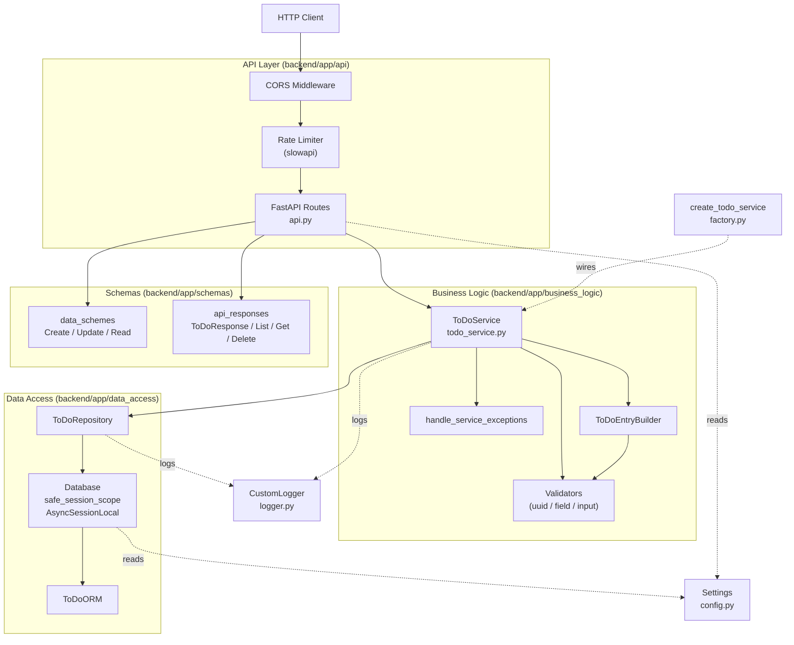
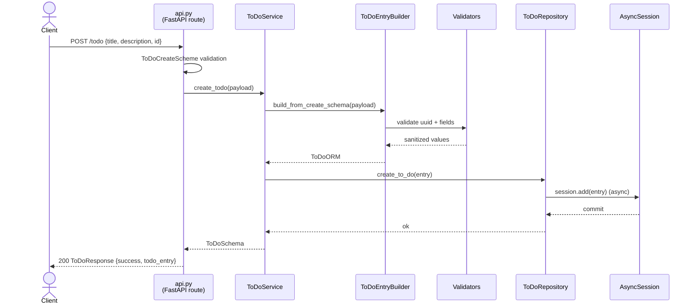
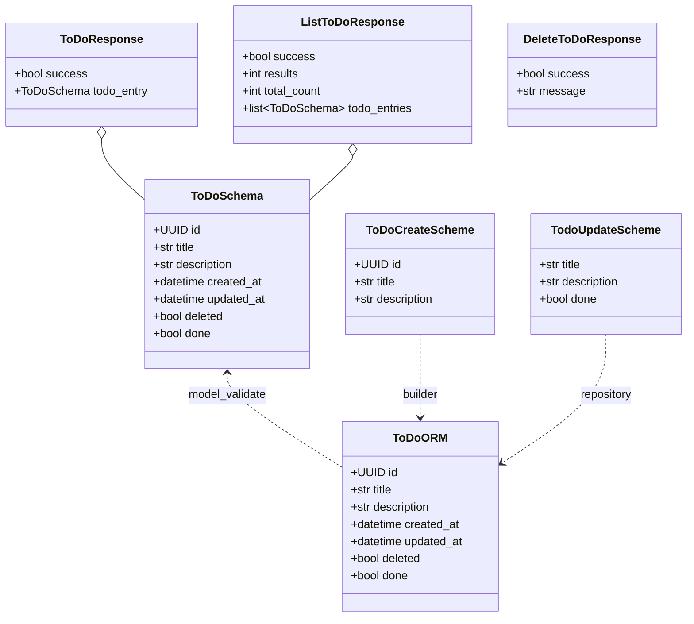
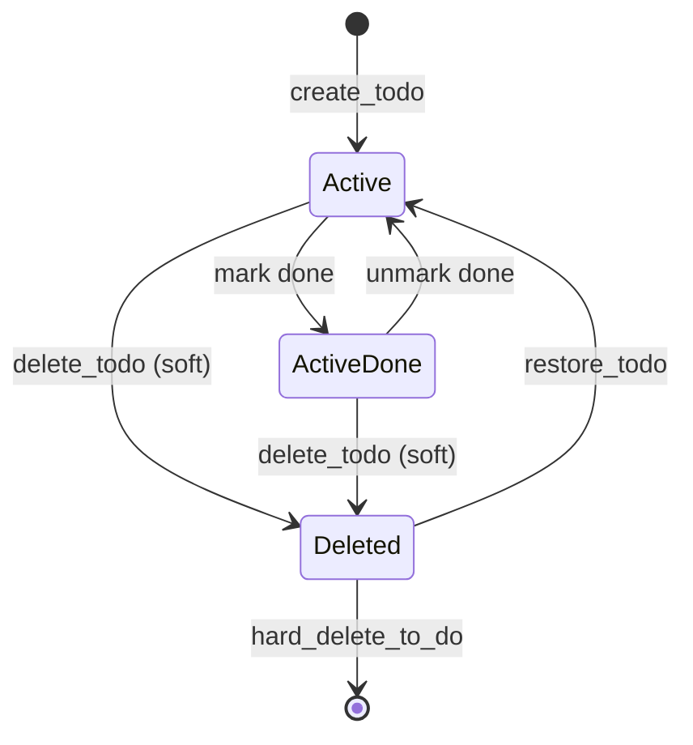

# Backend Architecture

FastAPI + async SQLAlchemy (aiosqlite) + Pydantic. Layered architecture with a single `Todo` entity.

## Layered Overview

## Request Flow: `POST /todo`

## Domain Model

## State Transitions

## Endpoints

| Method | Path | Purpose |
|--------|------|---------|
| GET | `/` | Health check |
| GET | `/todo` | List active todos (paginated) |
| POST | `/todo` | Create todo |
| GET | `/todo/{id}` | Get single todo |
| PUT | `/todo/{id}` | Update todo (or mark done) |
| DELETE | `/todo/{id}` | Soft-delete |
| GET | `/todo/deleted` | List soft-deleted todos |
| PATCH | `/todo/{id}/restore` | Restore a soft-deleted todo |

Rate limits: 30/min for mutating endpoints, 60/min for reads (configurable; see `backend/app/config.py`).

Full contract: [`specs/002-modernize-fullstack/contracts/api-endpoints.md`](../specs/002-modernize-fullstack/contracts/api-endpoints.md).

## Key Architectural Decisions

- **Async-only DB**: `aiosqlite` + `AsyncSession` end-to-end. No sync sessions exist.
- **Single declarative ORM**: `ToDoORM` in `data_access/database.py`. The earlier dual declarative + imperative mapping was removed.
- **Soft delete by default**: `delete_to_do` flips `deleted=True`. A separate `hard_delete_to_do` exists on the repository for purge flows but is not exposed via HTTP.
- **Service-level exception decorator**: `handle_service_exceptions` normalizes repository/validation errors into the domain exceptions the API layer catches.
- **Dependency wiring in `factory.py`**: `create_todo_service()` is the single place where validators, builder, repository, and logger are composed.
