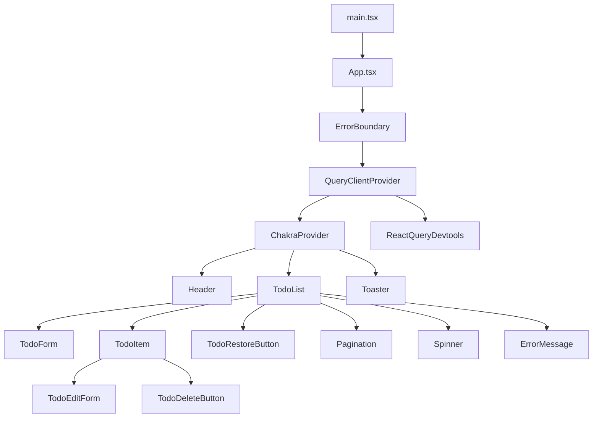
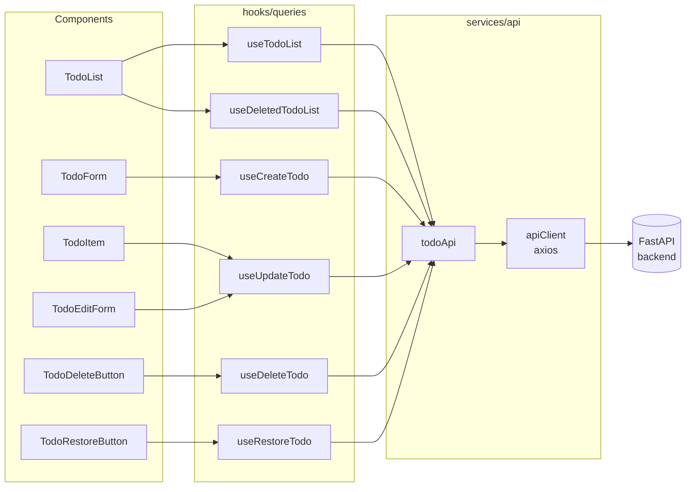
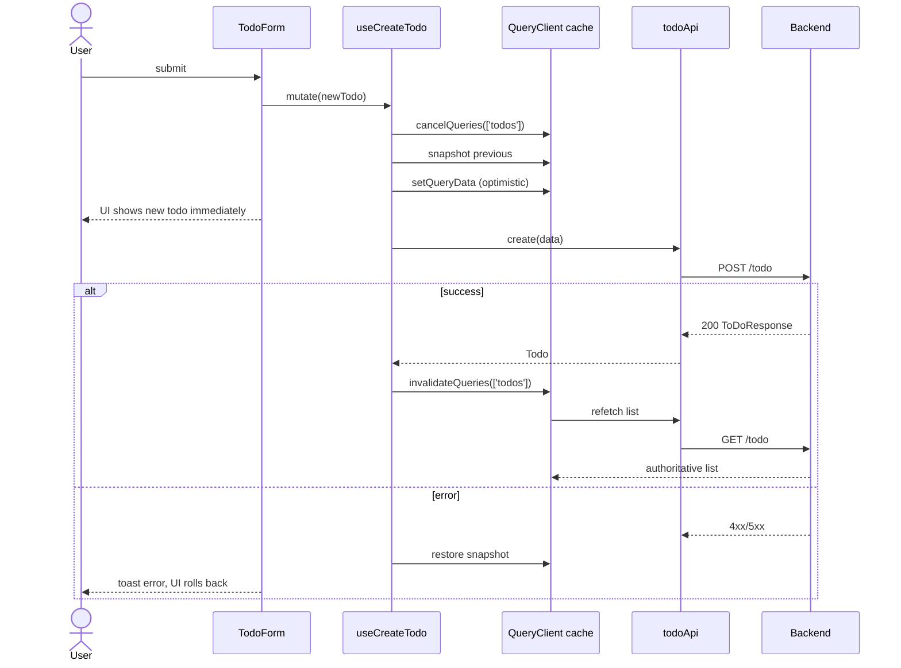

# Frontend Architecture

React 19 + TypeScript + Vite. UI from Chakra UI v3, server state from TanStack Query v5. Tests run on Vitest.

## Component Tree

## Server-State Layer

Every server interaction goes through a TanStack Query hook, which delegates to the `todoApi` singleton, which uses the shared Axios `apiClient`.

## Optimistic Update Flow (Create)

All mutations follow the same `onMutate` → `onError` rollback → `onSettled` invalidate pattern. Create is shown here; update/delete/restore are structurally identical.

## Module Map

| Path | Responsibility |
|------|----------------|
| `src/main.tsx` | Vite entry point, mounts `<App />` |
| `src/App.tsx` | Provider composition: ErrorBoundary → QueryClientProvider → ChakraProvider |
| `src/components/Header.tsx` | App header |
| `src/components/todos/` | Domain components: `TodoList`, `TodoForm`, `TodoItem`, `TodoEditForm`, `TodoDeleteButton`, `TodoRestoreButton` |
| `src/components/common/` | Shared UI: `Pagination`, `Spinner` |
| `src/components/errors/` | `ErrorBoundary`, `ErrorMessage` |
| `src/components/ui/toaster.tsx` | Chakra Toaster mount |
| `src/hooks/queries/` | One TanStack Query hook per backend operation |
| `src/hooks/useToast.ts` | Toast helper bound to the shared toaster |
| `src/hooks/useTodoValidation.ts` | Client-side title/description validation matching backend rules |
| `src/services/api/client.ts` | Axios instance, base URL, error normalization |
| `src/services/api/todoApi.ts` | Single source of truth for endpoint URLs and request/response shapes |
| `src/config/queryClient.ts` | Shared `QueryClient` (stale times, retry policy) |
| `src/config/env.ts` | Typed access to `import.meta.env` |
| `src/types/todo.ts` | Shared Todo / request / response types |
| `src/lib/toaster.ts` | Toaster singleton |

## Key Decisions

- **One hook per endpoint** under `hooks/queries/`. Components never call `todoApi` directly — they go through a hook so caching, optimistic updates, and invalidation stay co-located with the mutation they belong to.
- **Single API surface**: every component path that hits the network goes through `services/api/todoApi.ts`. URLs and response shapes change in one place.
- **Optimistic UI on all mutations**: required by the project constitution. The `onMutate` / `onError` / `onSettled` triad in each mutation hook implements it consistently.
- **Path alias `@/*`**: configured in `tsconfig` and Vite. Imports use `@/hooks/...`, `@/services/...` rather than relative paths.
- **Error boundary at the root** so render-time errors in the tree fall through to a recoverable UI instead of a blank screen.
